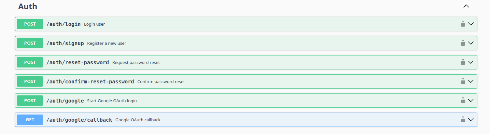
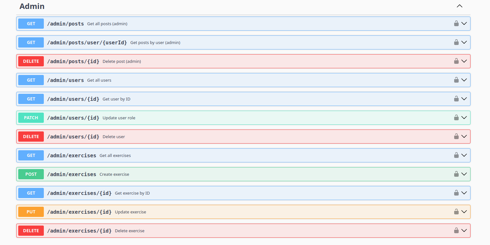
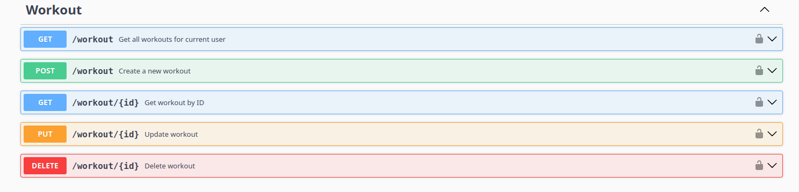
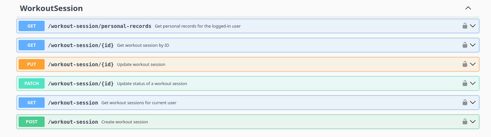
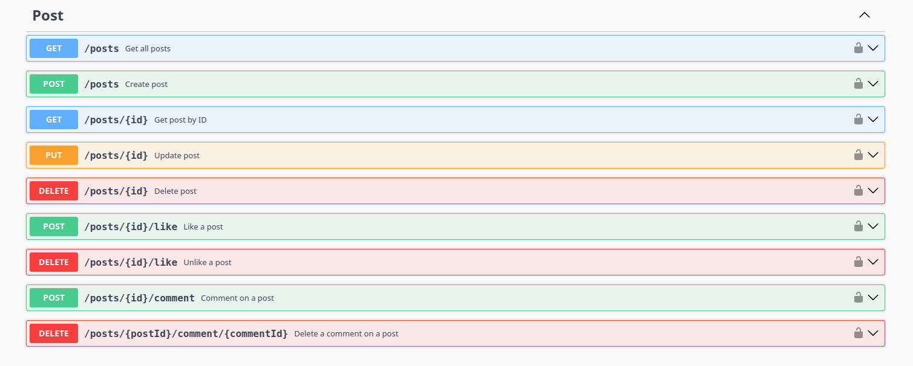
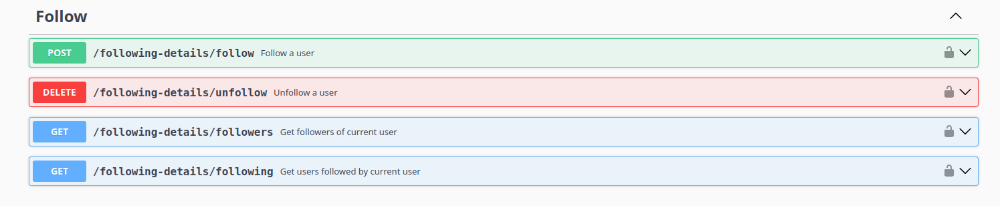

# Fitness-API

A robust RESTful API for fitness tracking, social interaction, and workout management. Built with Node.js, Express, and MongoDB, featuring JWT and Google OAuth authentication, input validation, and comprehensive Swagger documentation.

---

## 🚀 Features

- **User Authentication**
  - Register, login, and logout with JWT
  - Google OAuth login
  - Password hashing and security
- **User Profile Management**
  - View and update profile
  - Change password
  - Upload profile photo
- **Workout Management**
  - Create, update, delete workouts
  - Add exercises to workouts
  - Track workout sessions
  - Personal records for exercises
- **Workout Session Tracking**
  - Start, update, and complete workout sessions
  - Patch session status (e.g., completed, in-progress)
  - Retrieve personal records
- **Posts & Social Feed**
  - Create, update, delete posts
  - Like and comment on posts
  - View posts by user or all users
- **Follow System**
  - Follow/unfollow users
  - View followers and following lists
- **Admin Panel**
  - Manage users (view, block, delete)
  - Manage posts (view all, delete, view by user)
  - View statistics
- **Validation Middleware**
  - Input validation for all major routes using express-validator
- **Security**
  - Helmet for HTTP headers
  - CORS support
  - Rate limiting
- **Error Handling**
  - Global error handler
  - Catch-all endpoint for invalid routes
- **API Documentation**
  - Swagger UI at `/api-docs`
  - Complete OpenAPI spec for all endpoints

---

## 📦 Installation

```bash
# Clone the repository
git clone https://github.com/Eslamsaeed880/Fitness-API.git
cd Fitness-API

# Install dependencies
npm install
```

---

## ⚙️ Configuration

- Create a `.env` file in the root directory with the following variables:
  ```env
  # MongoDB
  MONGODB_URI=your_mongodb_connection_string

  # Server
  PORT=3000

  # JWT
  JWT_SECRET=your_jwt_secret
  JWT_SECRET_KEY=your_jwt_secret_key

  # Google OAuth
  GOOGLE_CLIENT_ID=your_google_client_id
  GOOGLE_CLIENT_SECRET=your_google_client_secret

  # Password & Security
  SALT_ROUNDS=10
  BASIC_PASSWORD=your_default_password

  # Email (for password reset, notifications)
  NODEMAILER_API_KEY=your_nodemailer_api_key
  EMAIL_SENDER=your_email_address

  # Frontend URL (for password reset links)
  FRONTEND_URL=http://localhost:3000
  ```
- Edit `config/mongodb.js` if needed for custom MongoDB setup.

---

## 🏃 Usage

```bash
# Start the server
npm start
```

- The API will run on `http://localhost:3000` by default.
- Access Swagger docs at `http://localhost:3000/api-docs`

---

## 📚 API Endpoints

See [swagger.json](./swagger.json) or visit `/api-docs` for full documentation.

---

## 🖼️ Screenshots

Below are screenshots from the `images/` folder:








---

## 🤝 Contributing

Pull requests are welcome! For major changes, please open an issue first to discuss what you would like to change.

---

## 📄 License

This project is licensed under the MIT License.

---

## 👤 Author

- [Eslam Saeed](https://github.com/Eslamsaeed880)

---

## 💡 Notes

- Ensure MongoDB is running before starting the server.
- For Google OAuth, set up credentials in the Google Developer Console.
- Add your own images to the `images/` folder and update the README links as needed.